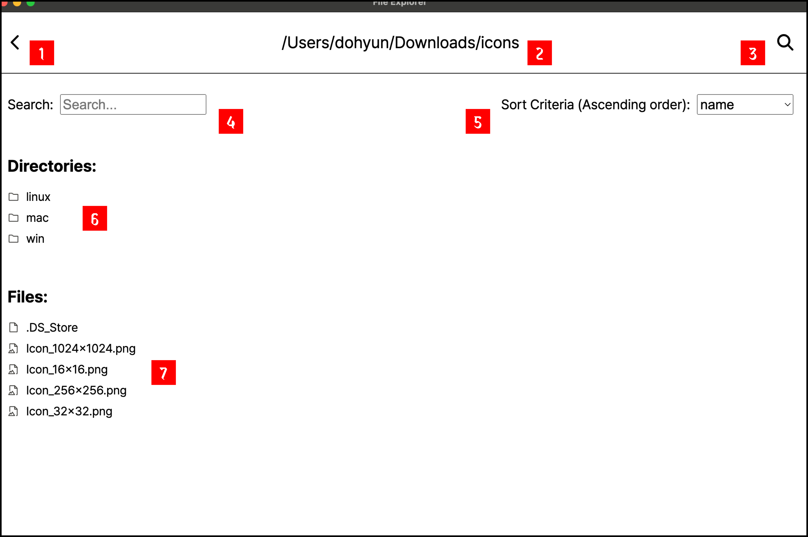

# File Explorer

<!--목차-->

# Table of Contents

- [About the Project](#about-the-project)
  - [Features](#features)
  - [Technologies](#technologies)
- [Getting Started](#getting-started)
  - [Prerequisites](#prerequisites)
  - [Installation](#installation)
- [Usage](#usage)
- [Contact](#contact)

# About the Project

_A user-friendly local file explorer that allows users to browse and view files._

Goal:  
Create an intuitive file explorer that allows customers  
to navigate through directories and explore files with minimal effort.

## Features



1. **Previous Button**

- It is a button that allows you to navigate to the parent directory when clicked.
- For example, pressing this button will move you to 'Users/dohyun/Downloads'.
- The button disappears when you are in the root directory.

2. **Title with Current Directory Path**

- It is the path of the current directory  
  where the files and subdirectories displayed below are located.
- The initial default value is the customer's 'Documents' folder  
  (Ex. /Users/username/Documents).

3. **Search Button**

- It is a button that allows you to reset the root directory when clicked.
- Clicking it will open the OS's native file explorer,  
  allowing you to reset the root directory using the file explorer.
- Once the reset is done, the current directory path,  
  as well as the files and subdirectories displayed below,  
  will be updated based on the new root directory.

4. **Search and Filter**

- A search filter that filters only files and subdirectories that contain search terms.
- It is in the form of input and can be typed.
- If the input is empty, all files and subdirectories are displayed.

5. **Sort Criteria Dropbox**

- Sort files and subdirectories according to the given criteria.
- It is a drop box with 5 sorting criteria.
- There are five criteria available: 'name', 'size', 'date modified', 'date created', and 'extension'.
- All criteria are sorted in ascending order.

6. **Directories**

- It shows the subdirectories in the current directory.
- Double-clicking a subdirectory will navigate to that subdirectory,  
  allowing you to view its files and subdirectories.
- If the selected subdirectory contains no files or subdirectories,  
  a warning message will appear, preventing access.

7. **Files**

- It shows the files in the current directory.
- Different icons are applied depending on the file type.
- You can double-click a file to open it.
- If the file is readable  
  (image, audio, video files under 2MB, and text files),  
  a new window in the app will open to display the file.
- If the file is not readable, a warning message will appear.

## Technologies

<div>
  
  
  
  
</div>
<div>
  
  
  
</div>

- Typescript 5.2.2
- React 18.2.0
- Vite 5.2.0
- Electron 30.0.6

# Getting Started

## Prerequisites

- npm

```bash
npm install npm@latest -g
```

## Installation

1. Repository Clone

```bash
git clone git@github.com:korbethebest/anigma.git
```

2. NPM Packages Install

```bash
npm install
```

# Usage

1. Experiencing the application locally

```bash
npm run dev
npm run build:dev
npm run dev:electron
```

2. Testing the application

```bash
npm run test
```

3. Packaging the application on Windows

```bash
npm run build:prod
npm run package-win
```

4. Packaging the application on Mac

```bash
npm run build:prod
npm run package-mac
```

# Contact

- 📧 shinbang6425@gmail.com
